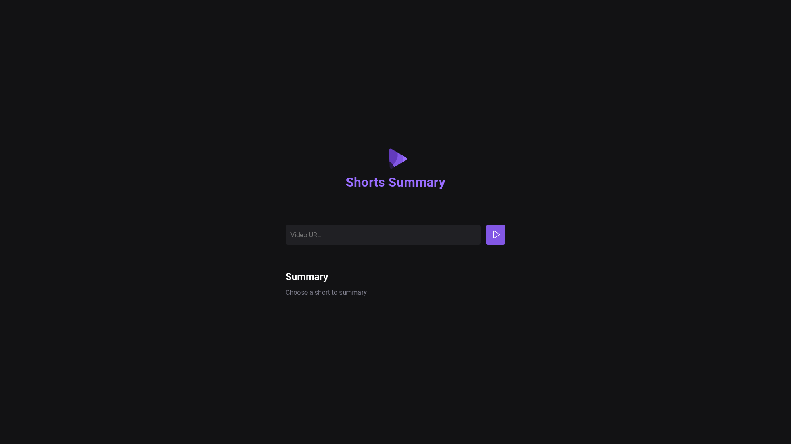

# NLW AI Web Interface
"An intuitive web page developed during the NLW AI event (Rocketseat), designed for submitting YouTube Shorts URLs to the backend and harnessing the power of AI processing to promptly extract and succinctly summarize the content."

## Installation
```bash
# Clone the repository
https://github.com/elciosato/nlw13-foundations-web.git

# Install dependencies
cd nlw13-foundations-web
npm install

# Startup
npm run web
```

## Usage
```bash
# Open
http://localhost:5173
```

